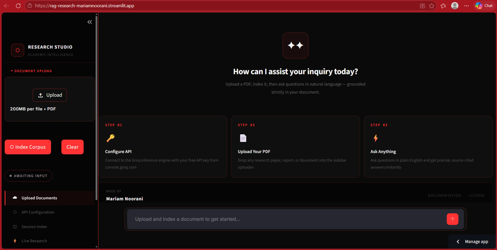
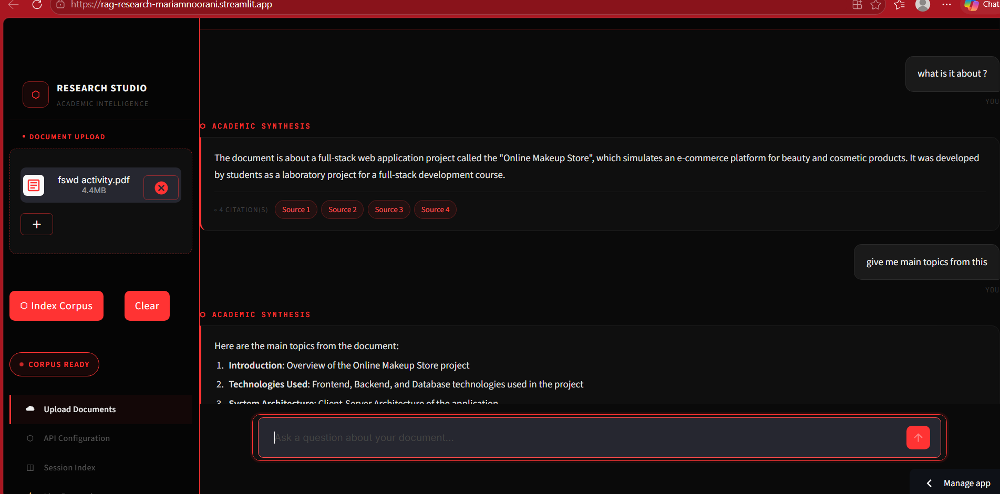

# Personal Research Assistant

Upload a PDF. Ask questions. Get answers — instantly.

🔗 **[Try it live](https://rag-research-mariamnoorani.streamlit.app/)**

---




---

## What it does

You upload any PDF — a research paper, notes, report — and chat with it. The AI reads your document and answers based strictly on what's in it. It also remembers the conversation, so you can ask follow-up questions naturally.

## Built with

- **Streamlit** — UI
- **LangChain + FAISS** — RAG pipeline
- **LLaMA 3.3 via Groq** — fast, free LLM
- **HuggingFace** — embeddings

## Run locally

```bash
git clone https://github.com/mariam-1209/rag-research-assistant.git
cd rag-research-assistant
pip install -r requirements.txt
# Add your Groq API key to .env
streamlit run app.py
```

Get a free API key at [console.groq.com](https://console.groq.com)

---

Built by **Mariam Noorani** · [GitHub](https://github.com/mariam-1209)
